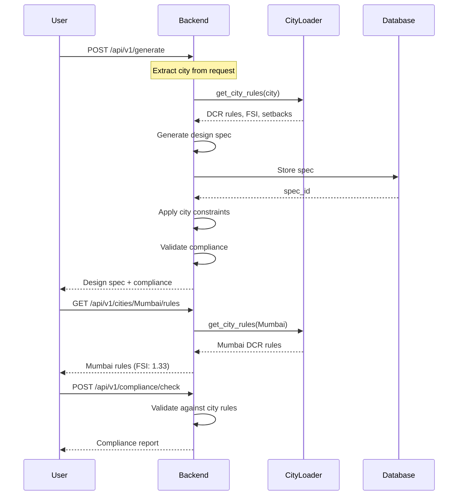

# API Flow Diagram

```mermaid
sequenceDiagram
    participant User
    participant Backend
    participant CityLoader
    participant Database

    User->>Backend: POST /api/v1/generate
    Note over Backend: Extract city from request

    Backend->>CityLoader: get_city_rules(city)
    CityLoader-->>Backend: DCR rules, FSI, setbacks

    Backend->>Backend: Generate design spec
    Backend->>Database: Store spec
    Database-->>Backend: spec_id

    Backend->>Backend: Apply city constraints
    Backend->>Backend: Validate compliance

    Backend-->>User: Design spec + compliance

    User->>Backend: GET /api/v1/cities/Mumbai/rules
    Backend->>CityLoader: get_city_rules(Mumbai)
    CityLoader-->>Backend: Mumbai DCR rules
    Backend-->>User: Mumbai rules (FSI: 1.33)

    User->>Backend: POST /api/v1/compliance/check
    Backend->>Backend: Validate against city rules
    Backend-->>User: Compliance report
```
