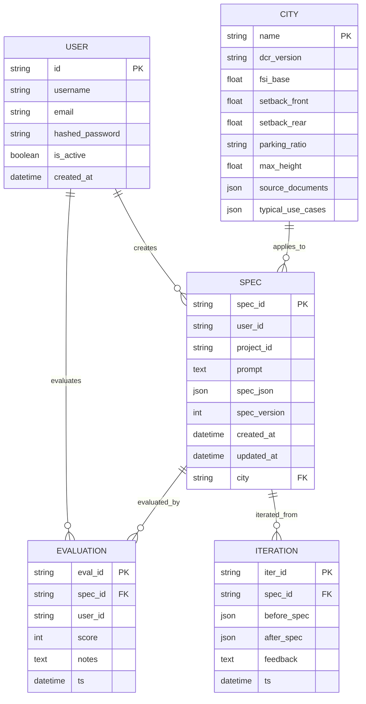

# Data Model Diagram

```mermaid
erDiagram
    CITY {
        string name PK
        string dcr_version
        float fsi_base
        float setback_front
        float setback_rear
        string parking_ratio
        float max_height
        json source_documents
        json typical_use_cases
    }

    SPEC {
        string spec_id PK
        string user_id
        string project_id
        text prompt
        json spec_json
        int spec_version
        datetime created_at
        datetime updated_at
        string city FK
    }

    EVALUATION {
        string eval_id PK
        string spec_id FK
        string user_id
        int score
        text notes
        datetime ts
    }

    ITERATION {
        string iter_id PK
        string spec_id FK
        json before_spec
        json after_spec
        text feedback
        datetime ts
    }

    USER {
        string id PK
        string username
        string email
        string hashed_password
        boolean is_active
        datetime created_at
    }

    CITY ||--o{ SPEC : "applies_to"
    SPEC ||--o{ EVALUATION : "evaluated_by"
    SPEC ||--o{ ITERATION : "iterated_from"
    USER ||--o{ SPEC : "creates"
    USER ||--o{ EVALUATION : "evaluates"
```
