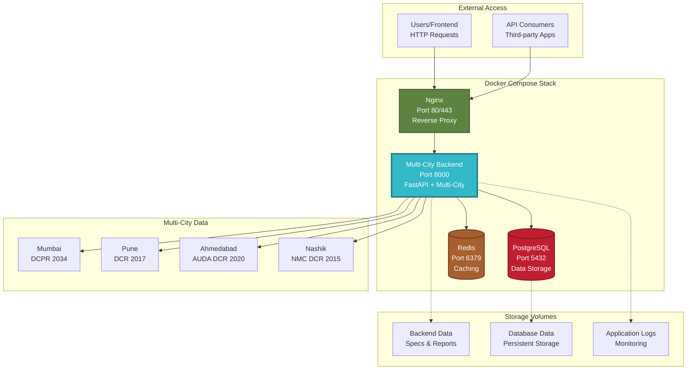

# Deployment Architecture Diagram

```mermaid
graph TB
    subgraph Docker Compose Stack
        Backend[Multi-City Backend<br/>Port 8000<br/>FastAPI + Multi-City]
        DB[(PostgreSQL<br/>Port 5432<br/>Data Storage)]
        Redis[(Redis<br/>Port 6379<br/>Caching)]
        Nginx[Nginx<br/>Port 80/443<br/>Reverse Proxy]

        Backend --> DB
        Backend --> Redis
        Nginx --> Backend
    end

    subgraph Multi-City Data
        Mumbai[Mumbai<br/>DCPR 2034]
        Pune[Pune<br/>DCR 2017]
        Ahmedabad[Ahmedabad<br/>AUDA DCR 2020]
        Nashik[Nashik<br/>NMC DCR 2015]
    end

    Backend --> Mumbai
    Backend --> Pune
    Backend --> Ahmedabad
    Backend --> Nashik

    subgraph Storage Volumes
        BackendData[Backend Data<br/>Specs & Reports]
        DBData[Database Data<br/>Persistent Storage]
        Logs[Application Logs<br/>Monitoring]
    end

    Backend -.-> BackendData
    DB -.-> DBData
    Backend -.-> Logs

    subgraph External Access
        Users[Users/Frontend<br/>HTTP Requests]
        API[API Consumers<br/>Third-party Apps]
    end

    Users --> Nginx
    API --> Nginx

    style Backend fill:#32b8c6,stroke:#1d7480,stroke-width:3px,color:#fff
    style DB fill:#c01f2f,stroke:#801520,stroke-width:2px,color:#fff
    style Redis fill:#a85f2f,stroke:#6b3d1f,stroke-width:2px,color:#fff
    style Nginx fill:#5e8240,stroke:#3d5629,stroke-width:2px,color:#fff
```
