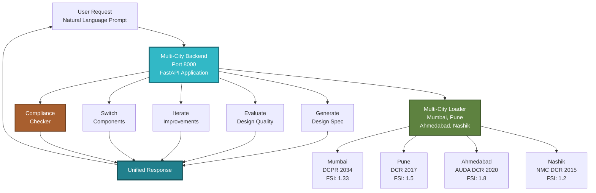

# System Overview Diagram

```mermaid
graph TB
    User[User Request<br/>Natural Language Prompt]

    User --> Backend[Multi-City Backend<br/>Port 8000<br/>FastAPI Application]

    Backend --> Generate[Generate<br/>Design Spec]
    Backend --> Evaluate[Evaluate<br/>Design Quality]
    Backend --> Iterate[Iterate<br/>Improvements]
    Backend --> Switch[Switch<br/>Components]

    Backend --> Cities[Multi-City Loader<br/>Mumbai, Pune<br/>Ahmedabad, Nashik]
    Backend --> Compliance[Compliance<br/>Checker]

    Cities --> Mumbai[Mumbai<br/>DCPR 2034<br/>FSI: 1.33]
    Cities --> Pune[Pune<br/>DCR 2017<br/>FSI: 1.5]
    Cities --> Ahmedabad[Ahmedabad<br/>AUDA DCR 2020<br/>FSI: 1.8]
    Cities --> Nashik[Nashik<br/>NMC DCR 2015<br/>FSI: 1.2]

    Generate --> Response[Unified Response]
    Evaluate --> Response
    Iterate --> Response
    Switch --> Response
    Compliance --> Response

    Response --> User

    style Backend fill:#32b8c6,stroke:#1d7480,stroke-width:3px,color:#fff
    style Cities fill:#5e8240,stroke:#3d5629,stroke-width:2px,color:#fff
    style Compliance fill:#a85f2f,stroke:#6b3d1f,stroke-width:2px,color:#fff
    style Response fill:#21808d,stroke:#165259,stroke-width:3px,color:#fff
```
