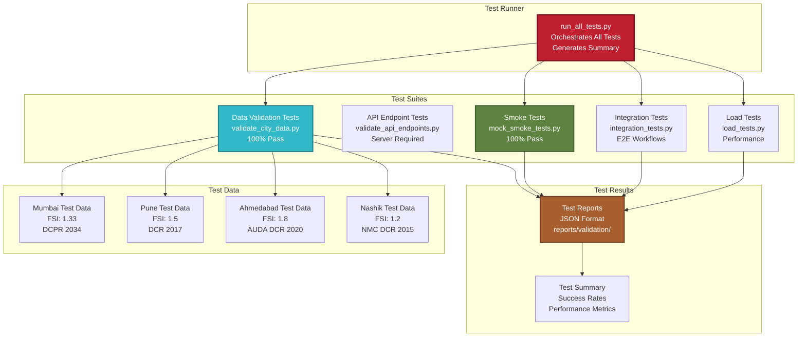

# Testing Flow Diagram

```mermaid
graph TB
    subgraph Test Suites
        DataTests[Data Validation Tests<br/>validate_city_data.py<br/>100% Pass]
        APITests[API Endpoint Tests<br/>validate_api_endpoints.py<br/>Server Required]
        SmokeTests[Smoke Tests<br/>mock_smoke_tests.py<br/>100% Pass]
        IntegrationTests[Integration Tests<br/>integration_tests.py<br/>E2E Workflows]
        LoadTests[Load Tests<br/>load_tests.py<br/>Performance]
    end

    subgraph Test Data
        Mumbai[Mumbai Test Data<br/>FSI: 1.33<br/>DCPR 2034]
        Pune[Pune Test Data<br/>FSI: 1.5<br/>DCR 2017]
        Ahmedabad[Ahmedabad Test Data<br/>FSI: 1.8<br/>AUDA DCR 2020]
        Nashik[Nashik Test Data<br/>FSI: 1.2<br/>NMC DCR 2015]
    end

    DataTests --> Mumbai
    DataTests --> Pune
    DataTests --> Ahmedabad
    DataTests --> Nashik

    subgraph Test Results
        Reports[Test Reports<br/>JSON Format<br/>reports/validation/]
        Summary[Test Summary<br/>Success Rates<br/>Performance Metrics]
    end

    DataTests --> Reports
    SmokeTests --> Reports
    IntegrationTests --> Reports
    LoadTests --> Reports

    Reports --> Summary

    subgraph Test Runner
        RunAll[run_all_tests.py<br/>Orchestrates All Tests<br/>Generates Summary]
    end

    RunAll --> DataTests
    RunAll --> SmokeTests
    RunAll --> IntegrationTests
    RunAll --> LoadTests

    style DataTests fill:#32b8c6,stroke:#1d7480,stroke-width:2px,color:#fff
    style SmokeTests fill:#5e8240,stroke:#3d5629,stroke-width:2px,color:#fff
    style Reports fill:#a85f2f,stroke:#6b3d1f,stroke-width:2px,color:#fff
    style RunAll fill:#c01f2f,stroke:#801520,stroke-width:3px,color:#fff
```
